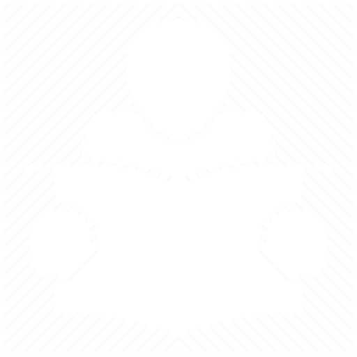
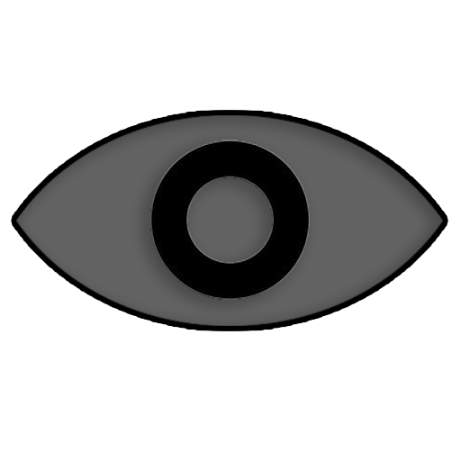

# Resouces for Presences

In this folder you can find resource images which you can use to display the status of what the user is doing.

## These Include:

| IMAGE                                                                                 | NAME                                   |
| ------------------------------------------------------------------------------------- | -------------------------------------- |
|                          | [play.png](play.png)                   |
|          | [pause.png](pause.png)                 |
|           | [stop.png](stop.png)                   |
|         | [search.png](search.png)               |
|       | [question.png](question.png)           |
|           | [live.png](live.png)                   |
|        | [reading.png](reading.png)             |
|        | [writing.png](writing.png)             |
|           | [call.png](call.png)                   |
|     | [video-call.png](video-call.png)       |
|    | [downloading.png](downloading.png)     |
|      | [uploading.png](uploading.png)         |
|         | [repeat.png](repeat.png)               |
|     | [repeat-one.png](repeat-one.png)       |
|       | [premiere.png](premiere.png)           |
|  | [premiere-live.png](premiere-live.png) |
|        | [viewing.png](viewing.png)             |

```ts
const enum Assets {
	Play = "https://cdn.rcd.gg/PreMiD/resources/play.png",
	Pause = "https://cdn.rcd.gg/PreMiD/resources/pause.png",
	Stop = "https://cdn.rcd.gg/PreMiD/resources/stop.png",
	Search = "https://cdn.rcd.gg/PreMiD/resources/search.png",
	Question = "https://cdn.rcd.gg/PreMiD/resources/question.png",
	Live = "https://cdn.rcd.gg/PreMiD/resources/live.png",
	Reading = "https://cdn.rcd.gg/PreMiD/resources/reading.png",
	Writing = "https://cdn.rcd.gg/PreMiD/resources/writing.png",
	Call = "https://cdn.rcd.gg/PreMiD/resources/call.png",
	VideoCall = "https://cdn.rcd.gg/PreMiD/resources/video-call.png",
	Downloading = "https://cdn.rcd.gg/PreMiD/resources/downloading.png",
	Uploading = "https://cdn.rcd.gg/PreMiD/resources/uploading.png",
	Repeat = "https://cdn.rcd.gg/PreMiD/resources/repeat.png",
	RepeatOne = "https://cdn.rcd.gg/PreMiD/resources/repeat-one.png",
	Premiere = "https://cdn.rcd.gg/PreMiD/resources/premiere.png",
	PremiereLive = "https://cdn.rcd.gg/PreMiD/resources/premiere-live.png",
	Viewing = "https://cdn.rcd.gg/PreMiD/resources/viewing.png",
}
```